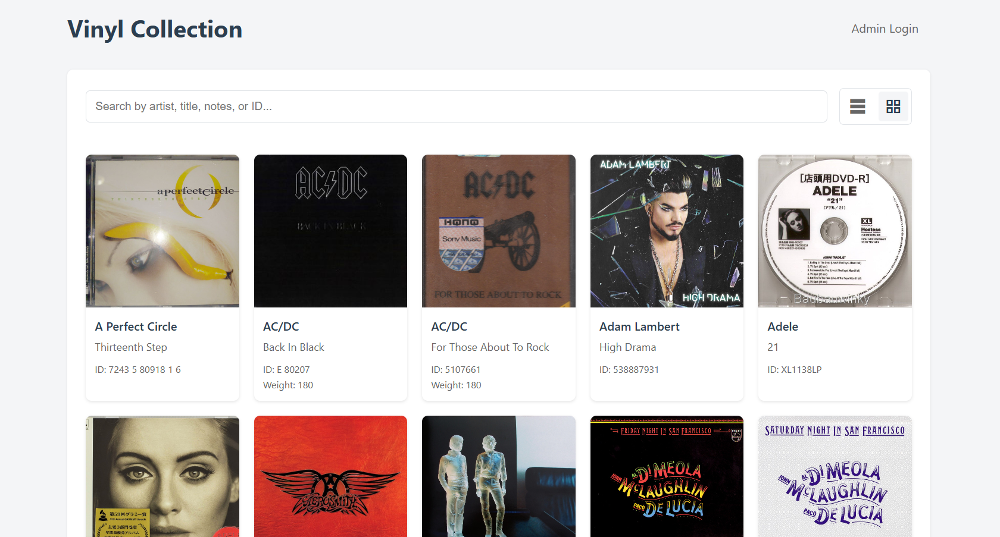

# Vinyl Collection Manager

A simple web application for managing a vinyl record collection.  

(Live preview coming soon)  

## Features

- View complete vinyl collection
- Sort by artist, title, ID, weight, notes, and duplicate status
- Search across multiple fields
- Admin panel for managing records
- Secure authentication system
- CSV import functionality

## Tech Stack

### Frontend
- Vanilla JavaScript
- HTML5
- CSS3 with CSS Variables for theming

### Backend
- Node.js
- Express.js
- SQLite (via better-sqlite3)
- JWT for authentication
- bcrypt for password hashing
